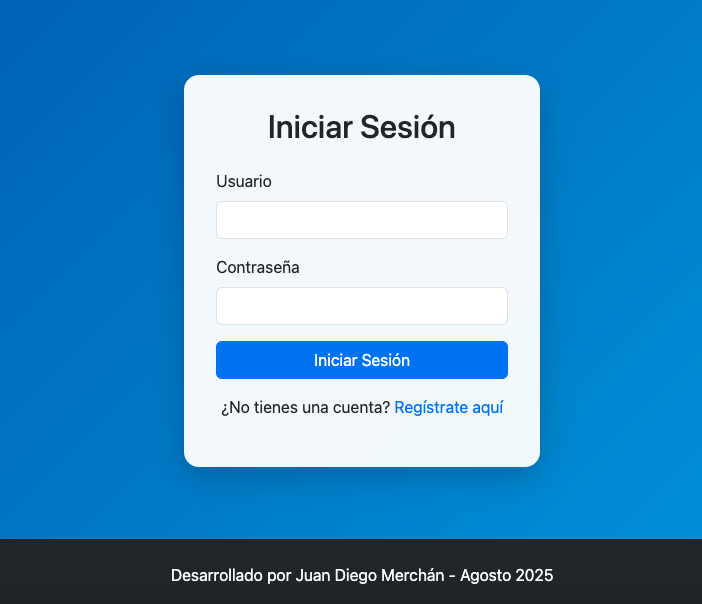
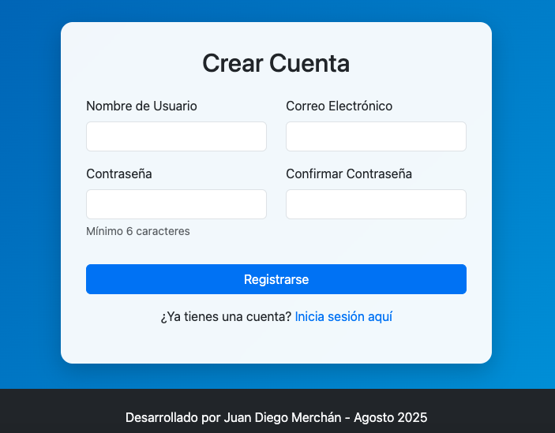
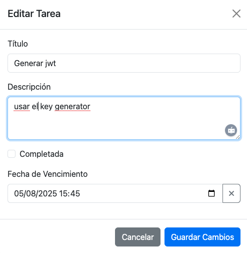
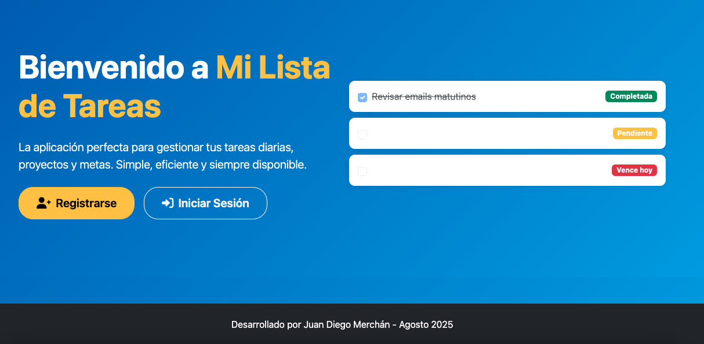
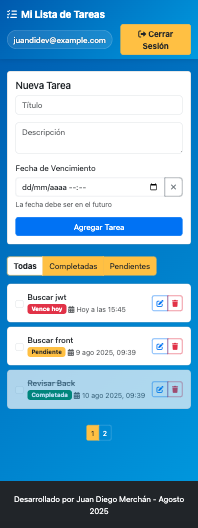

# TodoList - Aplicación Containerizada

Aplicación web completa para gestión de tareas, desarrollada como práctica de **Azure DevOps Board Management** y **Docker containerization**.

## 🎯 Propósito del Proyecto

Este proyecto demuestra:
- **Azure DevOps:** Gestión de proyectos con Epics, Features, Tasks y Sprints
- **Docker:** Containerización completa de la aplicación
- **Spring Boot:** Backend REST API con JWT authentication
- **PostgreSQL:** Base de datos relacional
- **Nginx:** Servidor web para el frontend

## 🐳 Arquitectura Docker

```
┌─────────────────┐    ┌──────────────────┐    ┌─────────────────┐
│   Frontend      │    │    Backend       │    │   Base de       │
│   Nginx         │───▶│   Spring Boot    │───▶│   Datos         │
│   (Puerto 80)   │    │   (Puerto 8080)  │    │   PostgreSQL    │
│                 │    │                  │    │   (Puerto 5432) │
└─────────────────┘    └──────────────────┘    └─────────────────┘
```

## 🚀 Inicio Rápido

### Prerrequisitos
- Docker Desktop instalado
- Git

### Ejecutar la aplicación
```bash
# Clonar el repositorio
git clone <repository-url>
cd ToDoListApi

# Construir y ejecutar con Docker Compose
docker-compose up --build

# La aplicación estará disponible en:
# Frontend: http://localhost
# Backend: http://localhost:8080
```

## 📋 Características

### Frontend (Nginx + HTML/CSS/JS)
- ✅ **Gestión completa de tareas**: Crear, editar, marcar como completada y eliminar
- 🔍 **Filtros inteligentes**: Ver todas, completadas o pendientes
- 📅 **Fechas de vencimiento**: Asignar fechas límite
- 📱 **Diseño responsivo**: Compatible con móviles y desktop
- 🎨 **Interfaz moderna**: Bootstrap 5 y efectos visuales
- 🔐 **Autenticación**: Sistema de login y registro con JWT

### Backend (Spring Boot)
- **REST API** con endpoints para tareas y usuarios
- **JWT Authentication** para seguridad
- **Spring Security** para autorización
- **JPA/Hibernate** para persistencia
- **PostgreSQL** como base de datos

### Base de Datos (PostgreSQL)
- **Tabla `usuarios`**: Gestión de usuarios
- **Tabla `tasks`**: Gestión de tareas
- **Relaciones** entre usuarios y tareas
- **Constraints** para integridad de datos

## 📸 Screenshots

### 🖥️ Interfaz Principal

*Vista principal de la aplicación con lista de tareas y filtros*

### 🔐 Autenticación

*Página de inicio de sesión con validaciones*


*Formulario de registro de nuevos usuarios*

### ✏️ Gestión de Tareas

*Modal para editar tareas existentes*

### 🏠 Página de Bienvenida

*Página de bienvenida para usuarios no autenticados*

### 📱 Diseño Responsive

*Vista móvil de la aplicación con diseño adaptativo*

## 🛠️ Tecnologías

### Frontend
- **HTML5**: Estructura semántica
- **CSS3**: Estilos responsive
- **JavaScript ES6+**: Lógica modular
- **Bootstrap 5**: Framework CSS
- **Font Awesome**: Iconografía
- **SweetAlert2**: Notificaciones

### Backend
- **Spring Boot 3.5.4**: Framework Java
- **Spring Security**: Autenticación y autorización
- **Spring Data JPA**: Persistencia
- **JWT**: Tokens de autenticación
- **Maven**: Gestión de dependencias

### Infraestructura
- **Docker**: Containerización
- **Docker Compose**: Orquestación
- **Nginx**: Servidor web
- **PostgreSQL**: Base de datos

## 📁 Estructura del Proyecto

```
ToDoListApi/
├── src/                          # Código fuente Spring Boot
│   ├── main/java/
│   │   └── com/juandidev/todolistapi/
│   │       ├── controller/       # REST Controllers
│   │       ├── model/           # Entidades JPA
│   │       ├── repository/      # Repositorios
│   │       ├── service/         # Lógica de negocio
│   │       └── security/        # Configuración de seguridad
│   └── resources/
│       └── application.properties
├── docker-compose.yml           # Orquestación de contenedores
├── Dockerfile                   # Imagen del backend
└── README.md

todolist-frontend-legacy/
├── index.html                   # Aplicación principal
├── login.html                   # Página de login
├── register.html                # Página de registro
├── css/style.css               # Estilos
├── js/                         # JavaScript modular
│   ├── app.js                  # Lógica principal
│   ├── api.js                  # Servicios API
│   ├── auth.js                 # Autenticación
│   └── validation.js           # Validaciones
├── Dockerfile                  # Imagen del frontend
└── nginx.conf                  # Configuración Nginx
```

## 🔧 Configuración

### Variables de Entorno
El archivo `docker-compose.yml` contiene todas las configuraciones necesarias:
- **PostgreSQL**: Usuario, contraseña, base de datos
- **Spring Boot**: URL de conexión a la base de datos
- **JWT**: Clave secreta para tokens

### Puertos
- **80**: Frontend (Nginx)
- **8080**: Backend (Spring Boot)
- **5432**: Base de datos (PostgreSQL)

## 📊 Azure DevOps Board

Este proyecto utiliza **Azure DevOps** para:
- **Epics**: Objetivos de alto nivel
- **Features**: Funcionalidades principales
- **Tasks**: Tareas específicas de desarrollo
- **Sprints**: Iteraciones de desarrollo

### Work Items
- ✅ **Epic**: Sistema de gestión de tareas
- ✅ **Feature**: Autenticación de usuarios
- ✅ **Feature**: CRUD de tareas
- ✅ **Feature**: Interfaz responsive
- ✅ **Task**: Configuración Docker
- ✅ **Task**: Implementación JWT
- ✅ **Task**: Diseño frontend

## 🎯 Endpoints API

### Autenticación
- `POST /api/auth/login`: Iniciar sesión
- `POST /api/auth/register`: Registrar usuario
- `GET /api/users/me`: Obtener perfil

### Tareas
- `GET /api/tasks`: Obtener tareas
- `POST /api/tasks`: Crear tarea
- `PUT /api/tasks/:id`: Actualizar tarea
- `PATCH /api/tasks/:id/status`: Cambiar estado
- `DELETE /api/tasks/:id`: Eliminar tarea

## 🚀 Comandos Docker

```bash
# Construir y ejecutar
docker-compose up --build

# Ejecutar en segundo plano
docker-compose up -d

# Ver logs
docker-compose logs

# Detener servicios
docker-compose down

# Detener y eliminar volúmenes
docker-compose down -v
```

## 📱 Uso de la Aplicación

1. **Registro**: Crear cuenta en `/register.html`
2. **Login**: Iniciar sesión en `/login.html`
3. **Gestión**: Usar la aplicación principal en `/index.html`

## 🎓 Aprendizajes

Este proyecto demuestra:
- **Containerización** con Docker
- **Microservicios** con Spring Boot
- **Gestión de proyectos** con Azure DevOps
- **Desarrollo full-stack** moderno
- **DevOps** básico con Docker Compose

## 👨‍💻 Desarrollador

**Juan Diego Merchán** - Agosto 2025

---

*Proyecto desarrollado como práctica de Azure DevOps Board Management y Docker containerization.*


